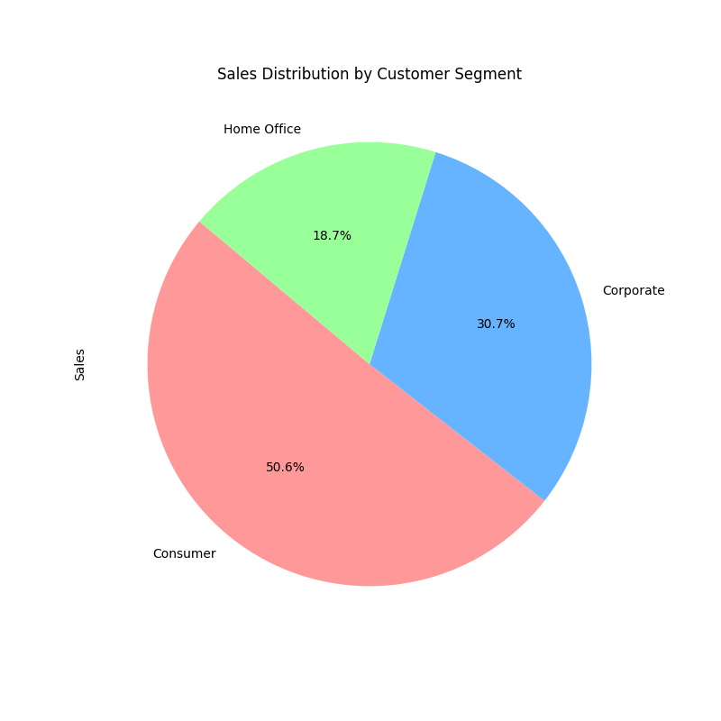
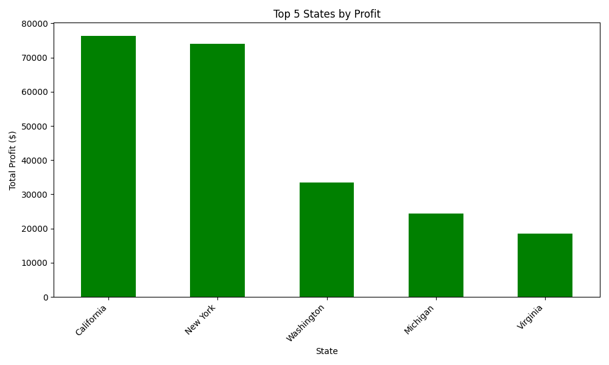

# 🚀 Superstore Report Automation

[](https://www.python.org/)  
[](https://jupyter.org/)  
[](https://opensource.org/licenses/MIT)  

Automate your **Superstore Sales Analysis**! Clean data, compute key metrics, generate charts, and produce a professional PDF report in minutes.  


## 🌟 Features

- **Data Preprocessing**  
  Clean your dataset, handle dates, drop unnecessary columns, and save as `Superstore_Preprocessed.csv`.

- **Sales & Profit Analysis**  
  Compute total sales, profit, top sub-categories, top customer segments, and other aggregates.

- **Visualizations**  
  Auto-generate charts like pie charts for segment sales, bar charts for categories/states, and more.

- **PDF Reporting**  
  Generate a complete `Superstore_Report.pdf` with tables, summaries, and embedded charts using **ReportLab**.

---

## 🛠 Requirements

- Python 3.10+  
- Jupyter Notebook / JupyterLab  
- Libraries: `pandas`, `matplotlib`, `reportlab`  

Install dependencies:

```bash
pip install -r requirements.txt
````

---

## ⚡ Usage

1. **Prepare the Data**
   Place `Sample - Superstore.csv` in the notebook directory.

2. **Run Notebook**
   Open `Report Automation.ipynb` in Jupyter and execute all cells sequentially.

3. **Outputs**

   * `Superstore_Preprocessed.csv` – cleaned dataset
   * Chart images (e.g., `sales_by_segment_pie_chart.png`)
   * `Superstore_Report.pdf` – summary report with tables and charts

---

## 📂 Notebook Structure

| Cell | Description                              |
| ---- | ---------------------------------------- |
| 2    | Preprocessing function & execution       |
| 3    | Load & display preprocessed data         |
| 4    | Compute & print key metrics              |
| 5    | Top categories by sales                  |
| 6    | Top states by profit + segment pie chart |
| 7    | Generate PDF report using ReportLab      |

---

## 🎬 Demo

**Example output charts:**


*Pie chart showing sales distribution by customer segment*


*Bar chart showing profit distribution across states*

#*Note*
the PDF report SCrrenshhot are in output file 
---

## 📄 License

MIT License – free to use and modify.

---

## ✉️ Contact

**Hemish Ravi** – [hemishdr897@gmail.com](mailto:hemishdr897@gmail.com)

```

